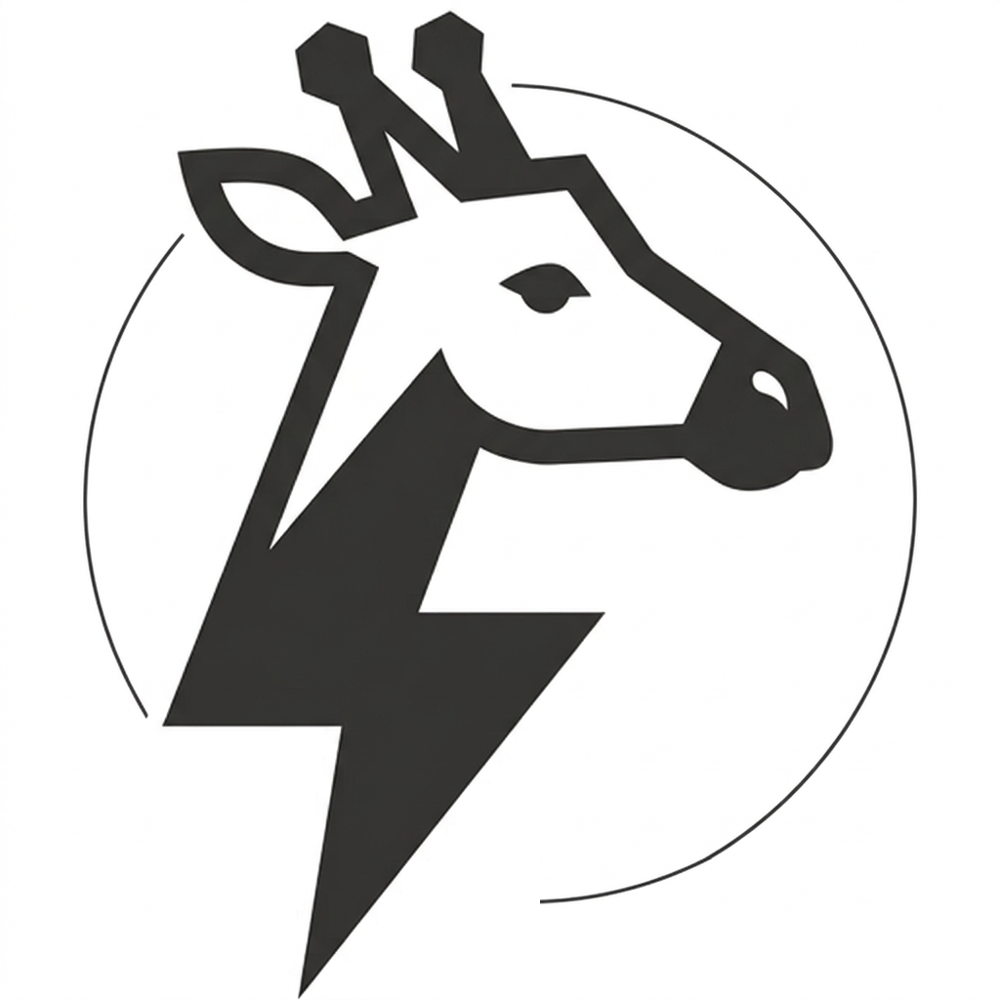

<p align="center">
  
</p>

# NavAgent

[](https://www.npmjs.com/package/navagent-mcp)
[](LICENSE)

Ultra-light MCP browser navigation. Token-efficient & anti-bot. Works on any site (SPAs, shadow DOM, iframes).

The AI sees a compact numbered list instead of screenshots or verbose accessibility trees:

```
AI sees:                   AI does:
────────────               ─────────────
📍 amazon.com              browse_click(6)
1. My Account [link]
2. Cart (0) [link]
3. Search [input]
4. Computers [link]
5. Electronics [link]
6. Books [link]
```

## Why NavAgent?

- **Token-efficient** — numbered lists instead of screenshots (~2000+ tokens) or ARIA trees (~15-20k tokens)
- **Anti-bot-proof** — uses Chrome's native extension messaging, not CDP. Undetectable by Cloudflare, Akamai, etc.
- **Works everywhere** — SPAs (hash routing), shadow DOM (forced open), same-origin iframes, contenteditable editors (DraftJS, ProseMirror)
- **Universal MCP** — works with Claude Code, Claude Desktop, Cursor, Windsurf, Zed, and any MCP client
- **Real browser session** — your cookies, your logins, no cloud proxy
- **Zero telemetry** — no tracking, fully open source

## Architecture

```
MCP Client (Claude Code, Cursor, Claude Desktop, etc.)
    ↓ stdio (Model Context Protocol)
navagent-mcp (npm package)
    ↓ WebSocket localhost:61822
Chrome Extension
    ↓ chrome.tabs.sendMessage
Content Script (DOM scanner)
```

Two components, both required:

| Component | Distribution | Install |
|-----------|-------------|---------|
| **MCP Server** | npm | `npx navagent-mcp` |
| **Chrome Extension** | Chrome Web Store / sideload | See below |

## Quick Start

### 1. Install the Chrome extension

**Chrome Web Store** (recommended): [Install NavAgent](https://chromewebstore.google.com/detail/navagent/cdfmgfmlmigfkknncaileajgbknjdepm)

**Or sideload:**
1. Clone this repo
2. Open `chrome://extensions/`
3. Enable **Developer mode**
4. Click **Load unpacked** → select the `chrome-extension/` folder

### 2. Add the MCP server to your AI client

<details>
<summary><strong>Claude Code</strong></summary>

Add to `.mcp.json` (project or global `~/.claude.json`):

```json
{
  "mcpServers": {
    "navagent": {
      "command": "npx",
      "args": ["-y", "navagent-mcp"]
    }
  }
}
```
</details>

<details>
<summary><strong>Claude Desktop</strong></summary>

Edit `claude_desktop_config.json`:
- macOS: `~/Library/Application Support/Claude/claude_desktop_config.json`
- Windows: `%APPDATA%\Claude\claude_desktop_config.json`

```json
{
  "mcpServers": {
    "navagent": {
      "command": "npx",
      "args": ["-y", "navagent-mcp"]
    }
  }
}
```
</details>

<details>
<summary><strong>Cursor</strong></summary>

Edit `~/.cursor/mcp.json`:

```json
{
  "mcpServers": {
    "navagent": {
      "command": "npx",
      "args": ["-y", "navagent-mcp"]
    }
  }
}
```
</details>

<details>
<summary><strong>Windsurf</strong></summary>

Edit `~/.windsurf/mcp.json`:

```json
{
  "mcpServers": {
    "navagent": {
      "command": "npx",
      "args": ["-y", "navagent-mcp"]
    }
  }
}
```
</details>

<details>
<summary><strong>Zed</strong></summary>

Edit `settings.json` → `context_servers`:

```json
{
  "context_servers": {
    "navagent": {
      "command": {
        "path": "npx",
        "args": ["-y", "navagent-mcp"]
      }
    }
  }
}
```
</details>

<details>
<summary><strong>OpenClaw</strong></summary>

Add to `openclaw.json` → `mcp.servers`:

```json
{
  "mcp": {
    "servers": {
      "navagent": {
        "command": "npx",
        "args": ["-y", "navagent-mcp"],
        "transport": "stdio"
      }
    }
  }
}
```
</details>

<details>
<summary><strong>Any MCP-compatible client</strong></summary>

NavAgent uses stdio transport. Configure your client to run:

```
command: npx
args: ["-y", "navagent-mcp"]
```
</details>

### 3. Verify

1. Chrome is open with the NavAgent extension enabled
2. Start your MCP client
3. Ask the AI: *"go to https://example.com and scan the page"*

## Available tools (12)

| Tool | Description |
|------|-------------|
| `browse_scan` | Scan the page → zones or flat list of clickable elements |
| `browse_zone` | Drill into a zone to see its elements |
| `browse_click` | Click an element by number (auto-rescans) |
| `browse_type` | Type into an input field |
| `browse_more` | Show next batch of elements (pagination) |
| `browse_scroll` | Physical scroll for lazy-loading / infinite scroll |
| `browse_read` | Visible page text (max 2000 chars) |
| `browse_extract` | Full page content as structured markdown with pagination |
| `browse_goto` | Navigate to a URL |
| `browse_back` | Go back to previous page |
| `browse_list_tools` | List WebMCP tools declared by the page |
| `browse_call_tool` | Invoke a WebMCP tool (navigator.modelContext) |

## How it works

**Element detection:**
- Strongly clickable: `<a>`, `<button>`, `<input>`, `<select>`, `<textarea>`, `[contenteditable]`, ARIA interactive roles, inline handlers, `tabindex >= 0`
- Weakly clickable: `cursor: pointer`, `data-*` attributes, framework directives (`@click`, `v-on:click`, `ng-click`)
- SPA hash routes (`#/path/...`, `#!/hashbang`) detected as navigation links

**Advanced capabilities:**
- **Shadow DOM** — `shadow-hook.js` forces `attachShadow({mode:'open'})` before page scripts. Walker traverses all shadow roots, including invisible hosts.
- **Same-origin iframes** — walker crosses iframe boundaries via `contentDocument` (micro-frontend architectures like OVH Manager)
- **Contenteditable** — `execCommand('insertText')` for rich editors (DraftJS, ProseMirror). Fast, framework-compatible, undetectable.
- **Zone detection** — landmarks (`nav`, `header`, `footer`, `aside`, `dialog`, `[aria-modal]`) for structured navigation on complex pages
- **Safety scan** — post-walk `querySelectorAll` fallback catches elements missed by the tree walker

## Tested on

| Site | Features tested |
|------|----------------|
| Reddit | Navigation, zones, infinite scroll |
| LinkedIn | Shadow DOM, contenteditable, dialog zones |
| YouTube | Zones, video lists |
| X.com | DraftJS contenteditable |
| OVH Manager | Same-origin iframes, SPA hash routing |

## Configuration

### Custom WebSocket port

Default: `61822`. To change:

1. Set `NAVAGENT_PORT` in the MCP config:
```json
{
  "mcpServers": {
    "navagent": {
      "command": "npx",
      "args": ["-y", "navagent-mcp"],
      "env": { "NAVAGENT_PORT": "61900" }
    }
  }
}
```

2. Set the same port in the Chrome extension options page.

## Security

- WebSocket listens on **localhost only** (`127.0.0.1`) — no external connections
- Extension uses minimal permissions: `activeTab`, `storage`, `alarms`
- No telemetry, no data sent anywhere
- Uses `chrome.tabs.sendMessage` (native extension messaging), not CDP — no `navigator.webdriver` flag, undetectable by anti-bot systems

## Development

```bash
cd mcp-server
npm install
npm test        # 111 tests (vitest + jsdom)
```

## Author

Dimitri Bouriez — [dimitri.bouriez.dev@gmail.com](mailto:dimitri.bouriez.dev@gmail.com)

## License

[MIT](LICENSE)
